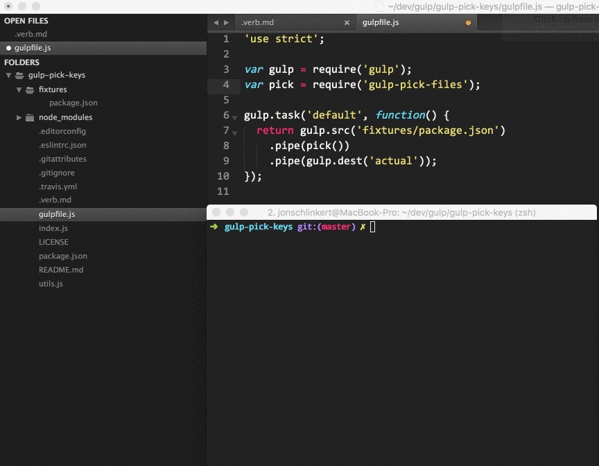

# gulp-pick-keys [](https://www.npmjs.com/package/gulp-pick-keys) [](https://npmjs.org/package/gulp-pick-keys)

Prompts the user to pick the properties to include in a JSON file. Useful in project generators for selectively including keys in generated files.

## Install

Install with [npm](https://www.npmjs.com/):

```sh
$ npm install --save gulp-pick-keys
```

## Usage

```js
var gulp = require('gulp');
var pick = require('gulp-pick-keys');

gulp.task('default', function() {
  return gulp.src('fixtures/package.json')
    .pipe(pick())
    .pipe(gulp.dest('actual'));
});
```

**Example**



## Contributing

This document was generated by [verb-readme-generator](https://github.com/verbose/verb-readme-generator) (a [verb](https://github.com/verbose/verb) generator), please don't edit directly. Any changes to the readme must be made in [.verb.md](.verb.md). See [Building Docs](#building-docs).

Pull requests and stars are always welcome. For bugs and feature requests, [please create an issue](../../issues/new). Or visit the [verb-readme-generator](https://github.com/verbose/verb-readme-generator) project to submit bug reports or pull requests for the readme layout template.

## Building docs

Generate readme and API documentation with [verb](https://github.com/verbose/verb):

```sh
$ npm install -g verb verb-readme-generator && verb
```

## Running tests

Install dev dependencies:

```sh
$ npm install -d && npm test
```

## Author

**Brian Woodward**

* [github/doowb](https://github.com/doowb)
* [twitter/doowb](http://twitter.com/doowb)

## License

Copyright © 2016, [Brian Woodward](https://github.com/doowb).
Released under the [MIT license](https://github.com/generate/gulp-pick-keys/blob/master/LICENSE).

***

_This file was generated by [verb](https://github.com/verbose/verb), v0.9.0, on June 11, 2016._